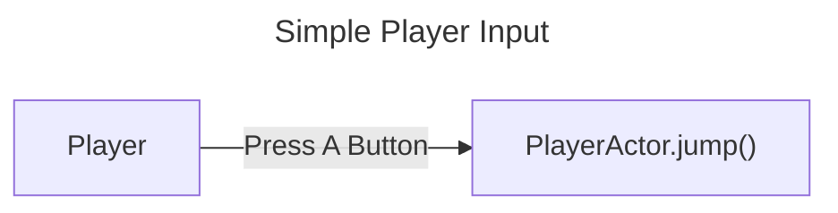
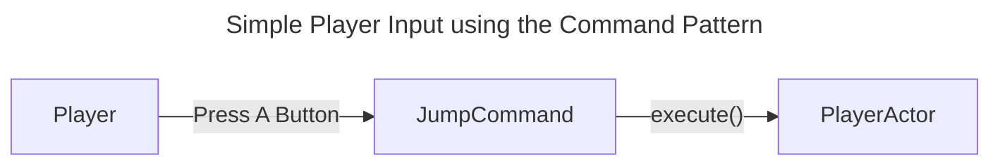
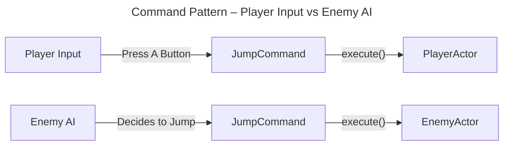

# Introduction
Out of all of the original GoF's design patterns, I feel like the most suitable one for game development is the **Command** pattern. I think a major problem with a lot of design patterns is that when used by a naïve developer, they end up being an overused tool fixing a lot of problems that at best, don't necessarily need use of the pattern to solve, or at worst end up creating more problems down the line.

Well then, what exactly is the command pattern? The GoF's definition is as follows

>Encapsulate a request as an object, thereby letting you parameterize clients with different requests, queue or log requests, and support undoable operations.

\- Design Patterns: Elements of Reusable Object-Oriented Software

In layman's terms, the idea behind the command pattern is to wrap actions in an object to allow you, the developer, to treat actions like data. You can save these actions, delay them, queue them, log them, or even undo them.

For example, say we had some code connected to a *PlayerActor* where if the player were to press A, then that would cause the *PlayerActor* object to jump in-game:


```gdscript
func _process(_delta):
	if Input.is_action_just_pressed("jump"): #where jump in the editor is set to A
		jump()
```

An implementation like this is more than enough for simple games, but what if you had enemies which share the same rules as the player? They would also need the jump logic in their own scripts. While we can't necessarily avoid writing new behavior for each new enemy type right now, we can avoid writing the same action logic over and over again. When multiple actors share the same kind of actions, copying and pasting that code is hard to maintain, and if we can reduce human error, we should. 

This is where the command pattern comes in:


Essentially, we are decoupling the direct connection from the Player pressing **A**, and the PlayerActor jumping. Instead, now when the Player presses **A**, we send a *JumpCommand* to the PlayerActor with an *execute()* method. The *execute()* method contains the actual logic for jumping, and can theoretically be shared between all actors.



# Example: Grid Movement

> [!important]
> The implementation below is an example of how one might implement the Command pattern in a Godot project.
> 
> Your project may not follow/use the same steps below!

> [!info]
> The code displayed below is only a small fraction of the code actually needed for everything to work, and everything put below mainly has to do with how we can use the Command pattern within Godot.
> 
> If you want to look at the full code, the repo on GitHub is right [here](https://github.com/chris-pitre/godot-4-command-pattern-example)!

Let's actually put this into practice! To illustrate use of the command pattern, we're going to create some basic grid based movement. Think something similar to [Sokoban](https://en.wikipedia.org/wiki/Sokoban) or the early [Pokémon](https://en.wikipedia.org/wiki/Pok%C3%A9mon) generations. In those games, movement is restricted to a grid, and the player can only move in the cardinal directions: North, East, South, and West, or alternatively, Up, Right, Down, and Left.

## Command Class

To implement this, let's create a parent Command class:

```gdscript
@abstract
class_name Command
extends RefCounted

func execute(actor: Actor) -> void:
	push_error("execute() not implemented!")

func undo(actor: Actor) -> void:
	push_error("undo() not implemented!")
```

This is going to be the bread and butter for every command that will be used by an actor. The command has two parts, `execute()` which will handle the intended logic of the command, and `undo()` which is the opposite logic of the command. 

For Godot specifics, there are 2 things to note with how we implemented the parent class:
1. The @abstract keyword is there to enforce usage of this class as a parent class that must be inherited by a child class. It was added in Godot 4.5, and if you're using an older version of Godot 4, you can simply omit the keyword and it should work perfectly fine.
2. We extend off of [RefCounted](https://docs.godotengine.org/en/stable/classes/class_refcounted.html#class-refcounted), not Object, Resource, or Node. There are a few reasons why we want to do this, and if you want the full writeup on when or where to use each type of object, the Godot documentation has a guide [here](https://docs.godotengine.org/en/stable/tutorials/best_practices/node_alternatives.html) detailing the pros and cons of each object type. We use [RefCounted](https://docs.godotengine.org/en/stable/classes/class_refcounted.html#class-refcounted) here because we don't want the full complexity of a [Node](https://docs.godotengine.org/en/stable/classes/class_node.html#class-node) for our commands, we don't necessarily need the serialization of [Resources](https://docs.godotengine.org/en/stable/classes/class_resource.html#class-resource), and we don't want to deal having to manage memory manually with [Objects](https://docs.godotengine.org/en/stable/classes/class_object.html#class-object), leaving us with [RefCounted](https://docs.godotengine.org/en/stable/classes/class_refcounted.html#class-refcounted) as our best option.

Now let's actually implement a command!

## MoveCommand Class

Since we want our actors to move in cardinal directions, we can extend off of our parent *Command* class and implement our `execute()` and `undo()` functions in *MoveCommand*:

```gdscript
class_name MoveCommand
extends Command

var direction: Vector2 = Vector2.UP

func execute(actor: Actor) -> void:
	var grid = actor.grid
	var new_grid_pos = actor.current_position + direction

	if grid.in_bounds(new_grid_pos):
		actor.current_position = new_grid_pos
		var target_world = grid.grid_to_world(new_grid_pos)
		actor.global_position = target_world

func undo(actor: Actor) -> void:
	var grid = actor.grid
	var new_grid_pos = actor.current_position - direction

	if grid.in_bounds(new_grid_pos):
		actor.current_position = new_grid_pos
		var target_world = grid.grid_to_world(new_grid_pos)
		actor.global_position = target_world
```

If you want to know what exactly the `grid` parameter does, please look at the full [repo](https://github.com/chris-pitre/godot-4-command-pattern-example) or the info box below, but essentially, it stores grid information for our "world", and gives us conversions between grid and world coordinates.

> [!info]- Grid Class Reference
> ```gdscript
> class_name Grid
> extends Resource
> 
> @export var tile_size: int = 32
> @export var grid_size: Vector2 = Vector2(16, 16)
> 
> var _cell_center: Vector2 = Vector2(tile_size / 2, tile_size / 2)
> 
> func grid_to_world(grid_pos: Vector2) -> Vector2:
> 	return grid_pos * tile_size + _cell
> 	
> func world_to_grid(world_pos: Vector2) -> Vector2:
> 	return (world_pos / tile_size).floor()
> 	
> func in_bounds(grid_pos: Vector2) -> bool:
> 	return (
> 		grid_pos.x >= 0 and grid_pos.y >= 0 and
> 		grid_pos.x < grid_size.x and
> 		grid_pos.y < grid_size.y
> 	)	
> ```

What this command does is it has a `direction` attribute that we can set, which can be any of the below directions:

```gdscript
Vector2.UP
Vector2.RIGHT
Vector2.DOWN
Vector2.LEFT
```

`execute()` will move an actor's position in whatever `direction` is, and `undo()` will simply do the opposite!

## Actor Class

Now we can make our actor which will be affected by our commands:

```gdscript
class_name Actor
extends Node2D

@onready var grid: Grid = preload("res://resources/grid/default_grid.tres")

var current_position: Vector2 = Vector2.ZERO
var command_history: Array[Command]

func _ready() -> void:
	current_position = grid.world_to_grid(global_position)
	global_position = grid.grid_to_world(current_position)

func execute(command: Command) -> void:
	command.execute(self)
	command_history.append(command)
	if len(command_history) >= 10:
		command_history.pop_front()
	
func undo() -> void:
	if len(command_history) > 0:
		var command = command_history.pop_back()
		command.undo(self)
```

Basically, our actor can take in a command in their own `execute()` method, which will then run the command and modify our actor accordingly. Once a command is executed, we can store it in a `command_history` stack, where our most recent commands are on top. When we use `undo()`, we can pop whatever is on top of the stack and `undo()` it.

## Player Input

Now, let's actually add some interface where we can interact with the PlayerActor to feed it commands:

> [!info]
> We use composition here! Eventually, I will probably make a post about composition over inheritance, but basically, we have a parent node called PlayerActor which has a child PlayerInputComponent. PlayerInputComponent has one export variable which takes in PlayerActor as a dependency.
> 
> ![[command pattern 1.png]]
> 
> ![[command pattern 2.png]]

```gdscript
class_name PlayerInputComponent
extends InputComponent

# InputComponent is a parent class that only contains the actor it is a component of
# var actor: Actor

func _process(delta: float) -> void:
	var direction = Vector2.ZERO

	if Input.is_action_just_pressed("move_right"):
		direction = Vector2(1, 0)
	elif Input.is_action_just_pressed("move_left"):
		direction = Vector2(-1, 0)
	elif Input.is_action_just_pressed("move_down"):
		direction = Vector2(0, 1)
	elif Input.is_action_just_pressed("move_up"):
		direction = Vector2(0, -1)

	if direction != Vector2.ZERO:
		var command = MoveCommand.new()
		command.direction = direction
		actor.execute(command)

	if Input.is_action_just_pressed("undo"):
		actor.undo()
```

If you've implemented movement before in a character controller, this will look very familiar to you. The main difference is we're abstracting things a little bit and only letting our InputComponent send commands to our actor.

After all this, we should have working grid movement for a Player using the command pattern!

![[command pattern player.mp4]]

## Enemy Input

Instead of using Godot's Input system, we can also start creating our own AI for other actors using our commands.

```gdscript
class_name ExampleEnemyInputComponent
extends InputComponent

func _ready() -> void:
	var timer = Timer.new()
	timer.autostart = true
	add_child(timer)
	timer.timeout.connect(_do_move)

func _do_move() -> void:
	var rand_int = randi_range(0, 3)
	var command = MoveCommand.new()
	
	match rand_int:
		0:
			command.direction = Vector2.UP
		1:
			command.direction = Vector2.RIGHT
		2:
			command.direction = Vector2.DOWN
		3:
			command.direction = Vector2.LEFT
			
	actor.execute(command)
```

We can implement some simple AI that just rolls a random number every second, and chooses a direction based on that number. Using the same idea as the PlayerInputComponent above, this allows for us to skip a lot of steps for creating a new "Enemy" class, and we can get straight into defining the intended behaviors for a new enemy.

![[command pattern enemy.mp4]]

# Conclusion

The command pattern is a design pattern that lets you encapsulate actions and behaviors as an object so you can treat them as data.